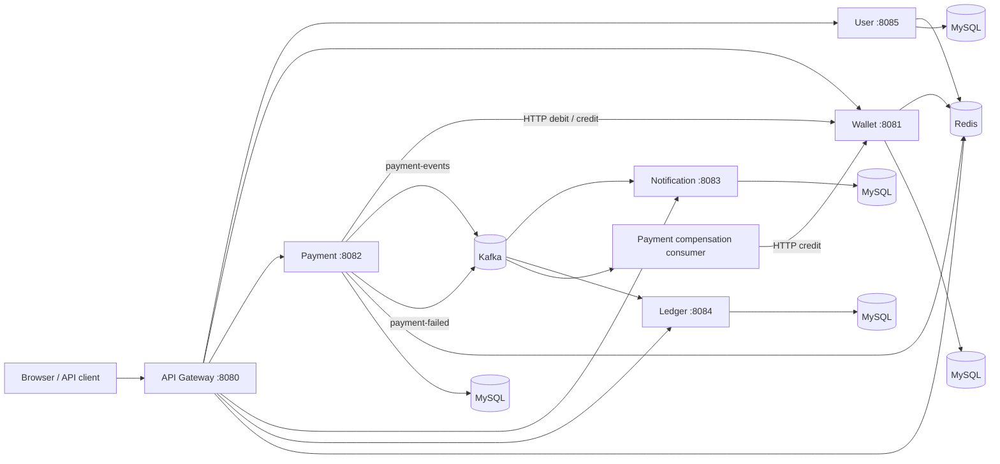

# PayVerse
PayVerse is a Java 21 fintech learning platform that models user accounts, wallets, transfers, notifications, and ledger records as six independently deployable Spring Boot services. A Spring Cloud Gateway provides the external API entry point, with MySQL, Redis, and Kafka infrastructure orchestrated locally through Docker Compose.
The repository focuses on service boundaries and integration patterns. It is a development/demo system, not a payment product or a production-ready financial platform.
## Recruiter Summary
**CV-ready project entry**
**PayVerse | Java 21, Spring Boot, Spring Cloud Gateway, MySQL, Redis, Kafka, Docker Compose**
- Designed and implemented a six-service payment backend with a Spring Cloud Gateway, service-owned MySQL databases, and Docker Compose orchestration.
- Built wallet transfers with synchronous debit/credit service calls, optimistic locking on wallet records, and Kafka events consumed by notification and ledger services.
- Added JWT-based gateway authentication, Redis-backed request limiting and wallet request-deduplication keys, plus a same-origin API workbench for guided end-to-end testing.
These bullets describe code in this repository. No throughput or reliability improvement is claimed because the project has no benchmark results. The Redis paths are rate limiting and request-deduplication safeguards, not wallet-balance caching.
## Architecture

| Service | Port | Responsibility |
| --- | ---: | --- |
| API Gateway | 8080 | Routes public APIs, validates JWTs, forwards the authenticated user ID, applies Redis-backed rate limits, and serves this workbench. |
| User Service | 8085 | Registration, login, access/refresh token handling, and user lookup endpoints. |
| Wallet Service | 8081 | Wallet creation, balance reads, add-money, debit, and credit operations; wallet rows use JPA optimistic versioning. |
| Payment Service | 8082 | Coordinates wallet debit/credit calls and publishes success/failure events. |
| Notification Service | 8083 | Consumes payment events, persists notification history, and exposes a WebSocket/STOMP endpoint. |
| Ledger Service | 8084 | Consumes successful payment events, stores debit/credit entries, and exposes aggregate admin statistics. |
Infrastructure includes MySQL 8, Redis 7, Kafka 7.6, and Zookeeper. The Compose stack uses one MySQL server with a separate database per service; it is not a separate database cluster per service.
## Payment Flow
1. A client sends `POST /payments/transfer` through the gateway with `senderUserId`, `receiverUserId`, and `amount`.
2. The payment service calls the wallet service synchronously to debit the sender and credit the receiver.
3. On success, the payment service publishes a `PAYMENT_SUCCESS` event to `payment-events`. The notification and ledger consumers process that event independently.
4. If the receiver credit call fails after the sender debit, the payment service publishes `PAYMENT_FAILED`. The payment consumer attempts to credit the sender back using the sender user ID and an idempotency key.
5. Notification history is stored before the best-effort WebSocket push. WebSocket clients connect directly to the notification service at `/ws` on port `8083`.
Kafka consumer processing is asynchronous, so notification and ledger reads may lag behind the successful transfer response. This implementation does not use a transactional outbox or a distributed transaction.
## Run Locally
### Requirements
- Docker Engine and Docker Compose v2
- Java 21 and Maven only if building or testing outside Docker
From the repository root:
```bash
docker compose up --build
```
The gateway's interactive API workbench is available at [http://localhost:8080/](http://localhost:8080/). Gateway health is available at [http://localhost:8080/actuator/health](http://localhost:8080/actuator/health). Check service readiness with:
```bash
docker compose ps
```
Compose supplies a development-only JWT signing secret when `JWT_SECRET` is unset. Set a private `JWT_SECRET` in the shell or a local `.env` file to override it. Do not use the development default outside a local demo. MySQL uses the local development credentials configured in Compose; do not expose these ports or credentials to an untrusted network.
Stop the stack and retain database data:
```bash
docker compose down
```
Reset the local databases as well (this permanently deletes the Compose MySQL volume):
```bash
docker compose down -v
```
## Test the User Journey
The workbench sends requests to the same-origin gateway and keeps the access token in `sessionStorage` for the current browser tab. Token values are redacted from its response display.
1. Open `http://localhost:8080/`, select **Create account**, and register a test user with a valid email, an Indian mobile number, and a password of at least eight characters.
2. Sign in as that user. The workbench shows the user ID from the access token.
3. Open **Wallet**, create a wallet, and add a small test amount. Use **Read balance** to check the resulting balance.
4. Register a second test user, sign in as that user, create its wallet, and add test funds. Record its user ID from the response or session display.
5. Sign back in as the sender, open **Transfer**, enter the receiver's user ID and a small amount, and submit.
6. Open **Records** to inspect notification history, unread count, and ledger statistics. Event consumers run asynchronously; retry a read after a moment if it has not processed yet.
The API workbench also provides a raw request panel for routes without a dedicated form. Protected routes require a valid bearer token; use the sign-in form to establish one.
## API Reference
All listed routes are available through `http://localhost:8080`. Except for register, login, and refresh-token, gateway routes require `Authorization: Bearer <access-token>`.
| Method | Path | Request / purpose |
| --- | --- | --- |
| `POST` | `/api/v1/auth/register` | `{ "email": "...", "phone": "9876543210", "password": "..." }` |
| `POST` | `/api/v1/auth/login` | `{ "email": "...", "password": "..." }` |
| `POST` | `/api/v1/auth/refresh-token` | `{ "refreshToken": "..." }` |
| `POST` | `/api/v1/auth/logout` | `{ "userId": 1 }` |
| `POST` | `/wallets` | `{ "userId": 1 }` |
| `GET` | `/wallets/{userId}/balance` | Read a wallet balance. |
| `POST` | `/wallets/add-money` | `{ "userId": 1, "amount": "250.00", "idempotencyKey": "demo-key" }` |
| `POST` | `/wallets/debit` | `{ "userId": 1, "amount": "25.00", "idempotencyKey": "demo-key" }` |
| `POST` | `/wallets/credit` | `{ "userId": 1, "amount": "25.00", "idempotencyKey": "demo-key" }` |
| `POST` | `/payments/transfer` | `{ "senderUserId": 1, "receiverUserId": 2, "amount": "25.00" }` |
| `GET` | `/notifications?userId={id}&page=0&size=10` | Paged notification history. |
| `GET` | `/notifications/unread-count?userId={id}` | Unread notification count. |
| `PATCH` | `/notifications/{notificationId}/read?userId={id}` | Mark a notification as read. |
| `GET` | `/admin/stats` | Ledger aggregate statistics. |
Individual services also expose actuator health endpoints on their mapped ports (for example `http://localhost:8081/actuator/health`). These service endpoints are for local diagnostics; use the gateway for application API calls.
## Build and Tests
Build all six Maven modules:
```bash
mvn clean package
```
Run the isolated payment-service unit tests:
```bash
mvn -pl payment-service -Dtest=PaymentServiceImplTest test
```
The `PaymentServiceIT` test currently starts a Spring application context that expects a reachable MySQL database; its `@Testcontainers` annotation does not configure a database container. Start the Compose dependencies before running that test, or configure the test profile with a dedicated database. Testcontainers dependencies are present, but the current test does not provision the containers. Test coverage and full end-to-end validation are not claimed as complete.
## Engineering Scope and Limitations
- Redis is used for gateway rate-limit counters, token storage, payment compensation deduplication, and wallet request keys. Wallet balance reads currently come from MySQL; there is no balance cache or cache-aside path.
- The add-money and credit idempotency checks use Redis keys with a 24-hour TTL. They are demo safeguards, not a durable, atomic payment-idempotency protocol. The transfer endpoint does not accept a caller-provided idempotency key.
- Wallet `@Version` provides optimistic concurrency detection, but the application does not implement a retry policy for version conflicts.
- Payment completion and event publication are separate operations. There is no outbox, Kafka transaction spanning MySQL, or exactly-once processing guarantee.
- The ledger stores entries from successful payment events; the wallet balance is not reconstructed from the ledger, and no reconciliation job is implemented.
- Gateway JWT validation is present, but production-grade authorization, secret management, observability, broker replication, and financial compliance controls are outside this project's scope.
- The demo uses a single Kafka broker and development database credentials. Never use it to handle real users, credentials, or funds.
## Technology
Java 21 · Spring Boot 3.5 · Spring Cloud Gateway · Spring Data JPA · MySQL 8 · Redis 7 · Kafka 7.6 · Docker Compose · JUnit 5 · Mockito · JaCoCo
# PayVerse

A production-shaped fintech backend built with Spring Boot, Kafka, Redis, and MySQL — six microservices behind a single API Gateway, implementing the core mechanics of a UPI-style payment platform: rate limiting, idempotent payments, optimistic-locked wallets, event-driven notifications, and an append-only ledger.

Built as a month-long deep dive connecting System Design theory directly to working code — every design decision below has a real implementation behind it, not just a diagram.

---

## Architecture

```
                        ┌─────────────────────┐
                        │   API Gateway :8080  │
                        │  JWT validation      │
                        │  Rate limiting (Redis)│
                        └──────────┬───────────┘
                                   │
        ┌───────────────┬─────────┼─────────┬───────────────┬───────────────┐
        │               │         │         │               │               │
   ┌────▼────┐    ┌─────▼────┐ ┌──▼───┐ ┌───▼──────────┐ ┌──▼──────┐ ┌──────▼─────┐
   │  User   │    │  Wallet  │ │Payment│ │ Notification │ │ Ledger  │ │ (internal) │
   │  :8085  │    │  :8081   │ │:8082  │ │    :8083     │ │  :8084  │ │            │
   └─────────┘    └──────────┘ └───┬───┘ └──────▲───────┘ └────▲────┘ └────────────┘
                                    │            │              │
                                    └─────► Kafka (payment-events) ──────┘
                                                  │
                              ┌───────────────────┴───────────────────┐
                              │      MySQL · Redis · Zookeeper          │
                              └──────────────────────────────────────────┘
```

| Service | Port | Responsibility |
|---|---|---|
| **API Gateway** | 8080 | Single entry point — JWT validation, user ID propagation, Redis-backed rate limiting |
| **User Service** | 8085 | Registration, login, JWT issuance, Redis-backed refresh tokens |
| **Wallet Service** | 8081 | Wallet balance, optimistic-locked concurrent updates, idempotent add-money |
| **Payment Service** | 8082 | Payment state machine, Kafka event publishing, Saga compensation on failure |
| **Notification Service** | 8083 | Kafka consumer, WebSocket/STOMP push, notification history, persistence-over-delivery |
| **Ledger Service** | 8084 | Append-only debit/credit entries, admin statistics |

**Infrastructure:** MySQL · Redis · Kafka · Zookeeper — all orchestrated via Docker Compose.

---

## Quick Start

```bash
git clone <repo-url>
cd payverse
docker-compose up
```

That's it — one command brings up all 6 services plus MySQL, Redis, Kafka, and Zookeeper, with health checks confirming everything is ready before traffic is expected to flow.

Verify everything is healthy:

```bash
docker-compose ps
```

---

## Core Design Decisions

### Rate limiting lives at the gateway, not in individual services
Implemented with a Redis Lua script wrapping `INCR` + `EXPIRE` as one atomic operation — two separate Redis calls aren't atomic together, and a crash between them can leave a counter with no expiry. The rate limiter sits at the API Gateway specifically so a request is rejected *before* it consumes any downstream service's resources.

### Payments are idempotent by design
Every payment request carries an idempotency key, checked against Redis with `SETNX` before any state-changing work happens. A client retry after a timeout returns the cached result instead of reprocessing — this is checked before the wallet debit, not after.

### Wallet concurrency is enforced structurally, not by convention
`Wallet` uses JPA's `@Version` field for optimistic locking. Two concurrent transfers hitting the same balance can't both silently succeed — one throws `OptimisticLockException` and retries safely.

### Failed payments compensate, they don't corrupt
Payment state machine: `INITIATED → PROCESSING → SUCCESS / FAILED`. If a credit fails after a debit already succeeded, a `PAYMENT_FAILED` event triggers a compensation consumer that reverses the original debit — Saga choreography, not a distributed transaction.

### The ledger is the source of truth, the wallet balance is a derived cache
Every `LedgerEntry` is an immutable, append-only event (debit or credit). The wallet's `balance` column is a convenience value — it can be reconstructed by summing the ledger at any time, which is exactly what the reconciliation job does. This is Event Sourcing, applied specifically to keep financial state auditable.

### Notifications guarantee persistence, not delivery
A notification is saved to the database first, independent of whether the real-time WebSocket push actually reaches the user. Delivery is best-effort on top of a guarantee that's already been kept — a dropped WebSocket connection never means a lost notification.

---

## Tech Stack

- **Language / Framework:** Java, Spring Boot
- **Messaging:** Kafka (producer idempotence, manual consumer commits, DLT via `@RetryableTopic`)
- **Caching / Coordination:** Redis (rate limiting, idempotency keys, cache-aside on wallet balance reads)
- **Persistence:** MySQL, Spring Data JPA
- **Testing:** JUnit 5, Mockito, Testcontainers (real MySQL + Kafka in integration tests), JaCoCo coverage
- **Resilience:** Resilience4j Circuit Breaker on inter-service calls

---

## Testing

Each service has its own unit test suite (Mockito-based) and integration tests using Testcontainers against real MySQL and Kafka — not mocks — for anything that depends on actual message delivery or database transactions.

```bash
# Run tests for a specific service
cd payverse-payment
mvn test

# Full build + test across all services
mvn clean install
```

Coverage is tracked via JaCoCo, targeting 80%+ on the service layer across all 6 services.

---

## Demo Walkthroughs

**5-minute walkthrough:** register → login → add money → transfer → notification received → ledger entry recorded — the full user journey, through the API Gateway as the single entry point, narrating the idempotency, optimistic locking, and Kafka decoupling decisions along the way.

**15–20 minute deep dive:** Saga compensation in `payverse-payment` (what happens when a credit fails after a debit), the rate limiter's position at the gateway (and why it moved there from sitting in front of `payverse-wallet` early on), and the ledger as an Event Sourcing implementation (why the wallet balance and the ledger are two different sources of truth).

To run the full smoke test yourself:

```bash
docker-compose down -v   # clean slate
docker-compose up        # fresh start, all services healthy
# then: register → login → add money → transfer → check notification → check ledger entry
```

---

## Project Status

PayVerse is feature-complete as of this build:

- ✅ All 6 services implemented, tested, and passing a fresh `docker-compose up` with zero manual fixes
- ✅ Full user journey verified end-to-end through the API Gateway
- ✅ JaCoCo coverage target met across all services
- ✅ Rate limiting, idempotency, optimistic locking, Saga compensation, and Event Sourcing all implemented with real, tested code behind each design

This was built as a month-long learning project connecting System Design theory (Rate Limiter, UPI Payment Gateway, Distributed Cache, Digital Wallet, Notification System) to a real, working implementation — the philosophy throughout was:

**Learn → Design → Implement → Test → Understand the failure mode → Revisit the design.**

---

## License

Personal learning project — not intended for production use as-is.